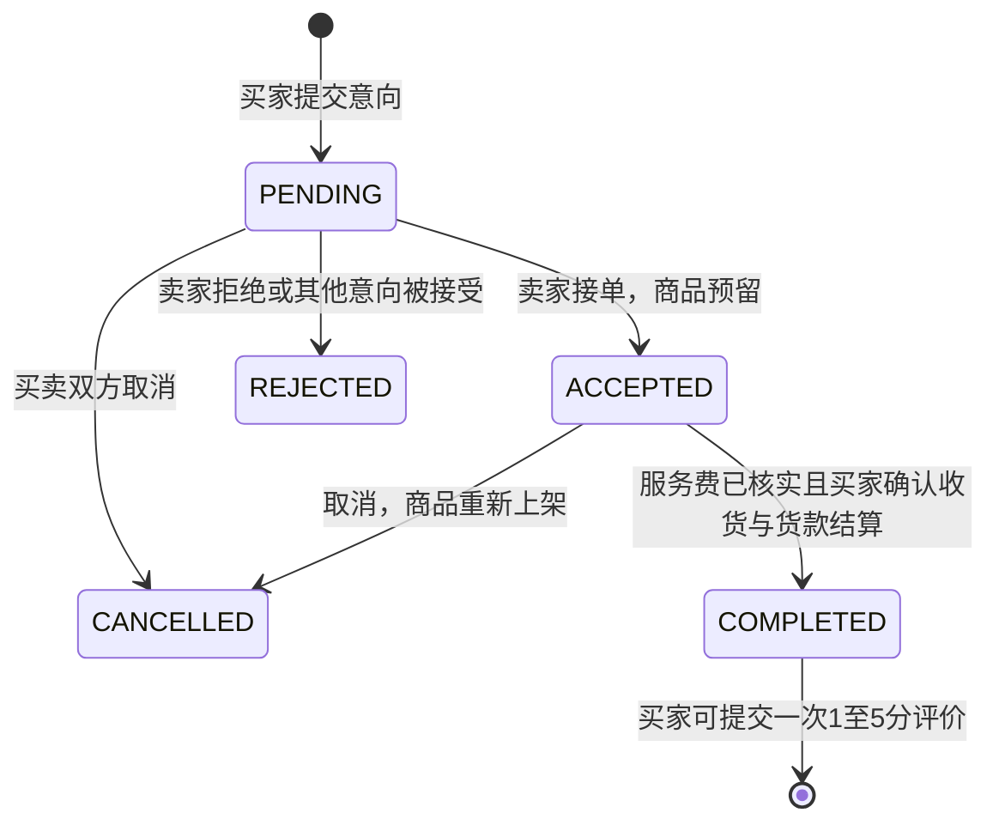
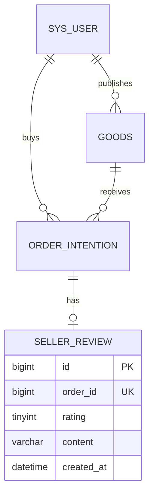
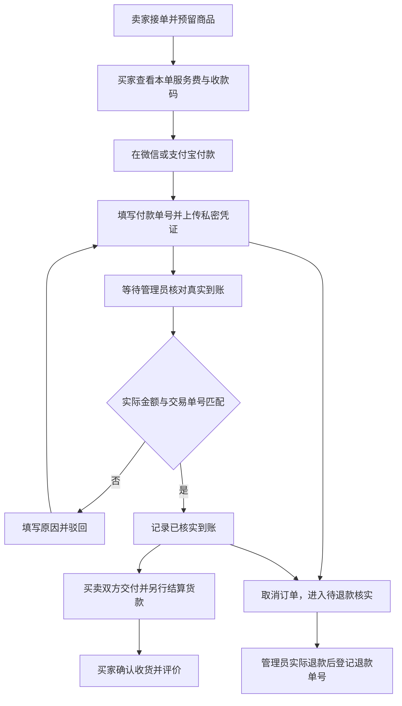
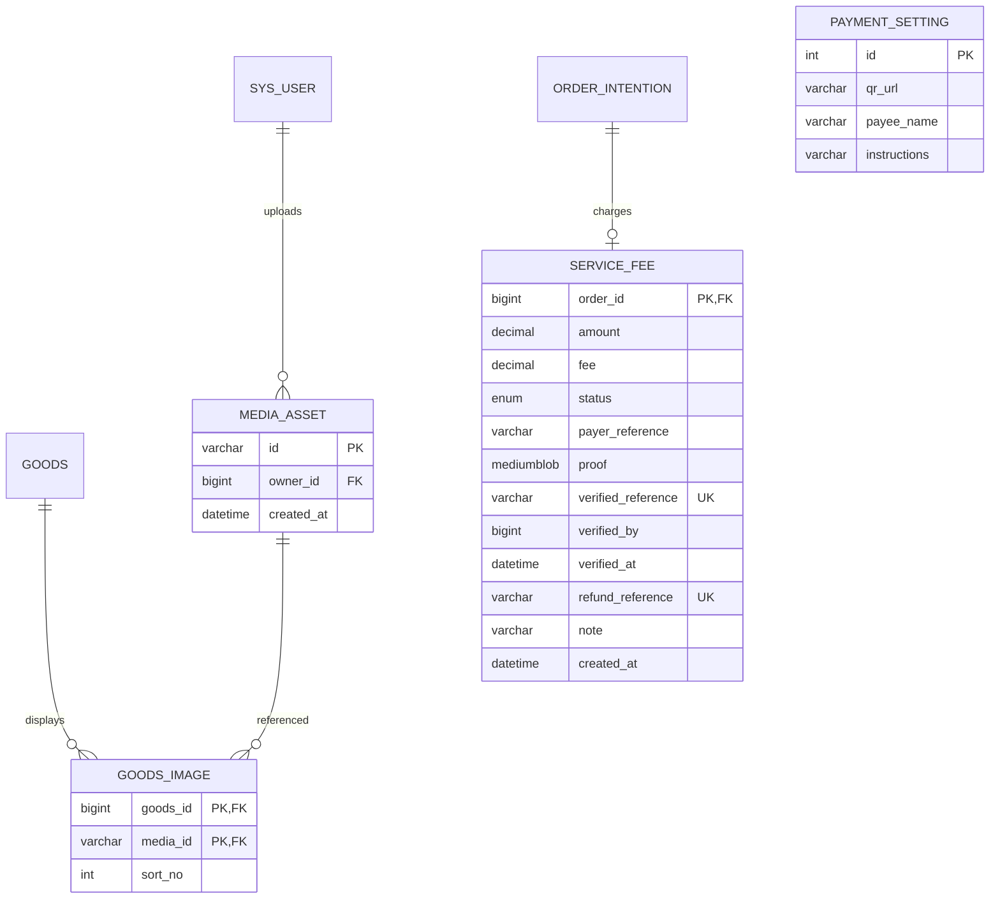
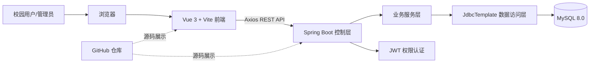
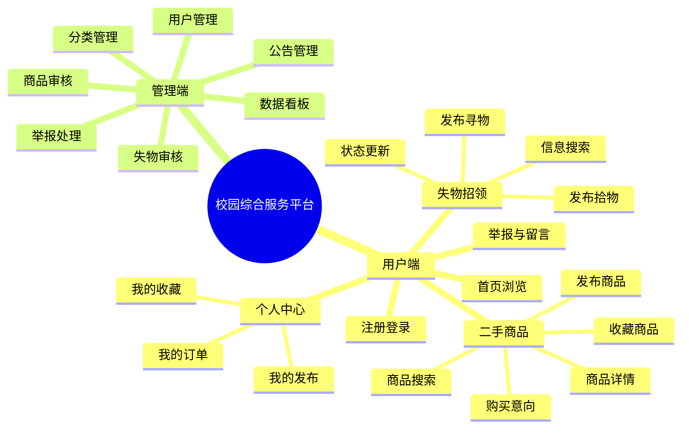
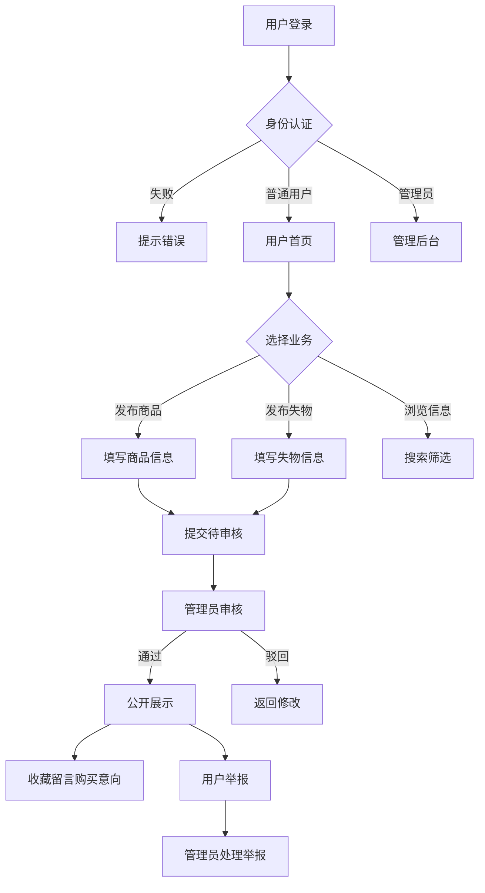
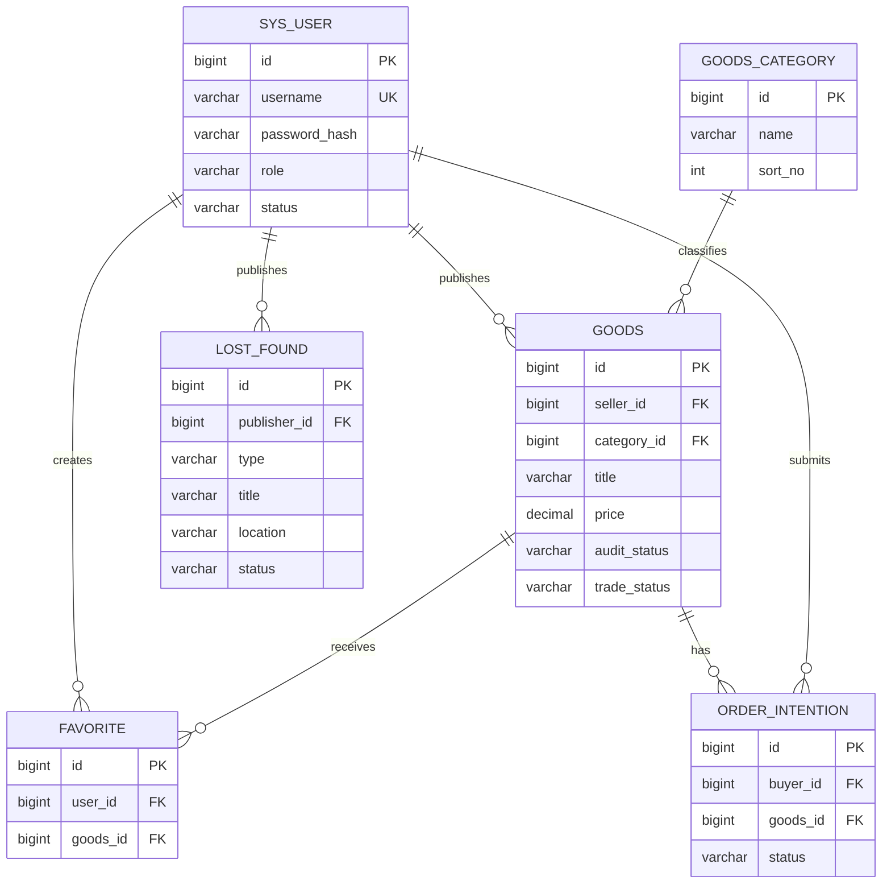

# 系统设计文档

本文包含目标设计，模块图中收藏、举报、治理等尚未全部实现。当前实现与验证范围以 README.md 和测试报告.md 为准。当前持久化使用 JdbcTemplate，MyBatis-Plus 为待迁移目标。

## 本次升级：订单与卖家信用

同一商品的交易变更先锁定商品行，再锁定订单行，避免同时接受多个购买意向。未完成订单不可评价，卖家不能给自己评分；每个订单的评价由数据库唯一键约束。信用分按已完成订单的有效评分取平均数，完成笔数包含已完成但尚未评价的订单。

商品表新增 delivery_mode（SELF_PICKUP/DORM_DELIVERY）、delivery_note、bargaining_allowed。订单状态增加 COMPLETED。seller_review 的 order_id 唯一，rating 限定1至5。旧版失物表补充 audit_status，历史记录默认待审核。

个人中心新增“我买到的/我卖出的”列表、接受/拒绝意向、取消交易、确认收货、评价弹窗及信用统计。确认收货和取消操作有确认提示。API 返回401时前端清理过期登录信息并提示重新登录。

## 本次升级：多图、自动更新与人工收取服务费

顶部重复菜单移除，底部保留首页、商品、发布、失物和我的入口。商品发布须提交1至6张本人上传的JPG/PNG图片，首张为封面；每张最大5MB，后端解码校验并重新编码PNG。商品图片和管理员收款码公开访问，付款凭证仅买家本人及管理员可以访问，禁止公开图片地址代替付款凭证。

失物搜索通过后端按标题、描述、地点查询。前端约5秒轮询最新商品、失物、订单及审核数据，页面恢复可见时补充刷新；新发布的信息通过审核后才向其他用户展示。所有用户可见的业务类型与状态映射为中文。

商品货款由买卖双方另行结算。平台仅收取默认2%的服务费，卖家接单时保存商品价格和本单服务费，金额保留两位小数。没有托管货款、卖家余额及站内提现。个人中心“我的付款”展示已核实服务费、待核实金额、待退款金额和记录；管理员查看服务费统计及待处理列表。

上传付款截图只进入PENDING，不能自动认定到账。管理员确认须填写实际到账金额及唯一交易单号；未核实服务费时后端禁止完成订单。取消已提交凭证或已核实的订单进入REFUND_PENDING，需人工查看账单后退款登记；仅从未核实到账的记录可标记未收到。网站不会自动转账或退款。未付款订单取消直接结束，费额四舍五入为零时无需扫码。

交易及服务费写入在事务中按商品、订单、服务费顺序加锁；到账单号和退款单号设置唯一约束，避免同一到账记录重复确认。此前已接单且没有服务费记录的历史订单需取消后重新提交。

表结构以database/schema.sql及database/migrations/20260911_media_wallet.sql为准。payment_setting固定id=1保存管理员配置。图片文件默认位于启动目录uploads，付款凭证存数据库，备份须覆盖两者。名称含wallet的现有接口与文件仅为兼容保留，实际含义为服务费记录。

## 1. 总体架构

## 2. 功能模块图

## 3. 核心业务流程图

## 4. E-R 图

## 5. 页面原型清单

| 页面 | 主要内容 | 角色 |
|---|---|---|
| 首页 | 搜索、分类、商品卡片、失物入口 | 全部 |
| 商品列表 | 关键词、分类、价格筛选、分页 | 全部 |
| 商品详情 | 图片、价格、成色、卖家、收藏、购买意向 | 登录用户 |
| 发布商品 | 标题、分类、价格、成色、图片、描述 | 普通用户 |
| 失物招领 | 寻物/拾物、地点、时间、特征描述 | 普通用户 |
| 个人中心 | 发布、收藏、购买意向、资料 | 普通用户 |
| 管理后台 | 审核、用户、举报、分类、公告、统计 | 管理员 |

## 6. 后端模块与接口

模块：`auth`、`user`、`goods`、`lostfound`、`message`、`report`、`admin`。

核心接口：`POST /api/auth/register`、`POST /api/auth/login`、`GET /api/goods`、`POST /api/goods`、`GET /api/goods/{id}`、`POST /api/orders/intentions`、`GET /api/lost-found`、`POST /api/lost-found`、`GET /api/admin/audits`、`PUT /api/admin/audits/{id}`。
